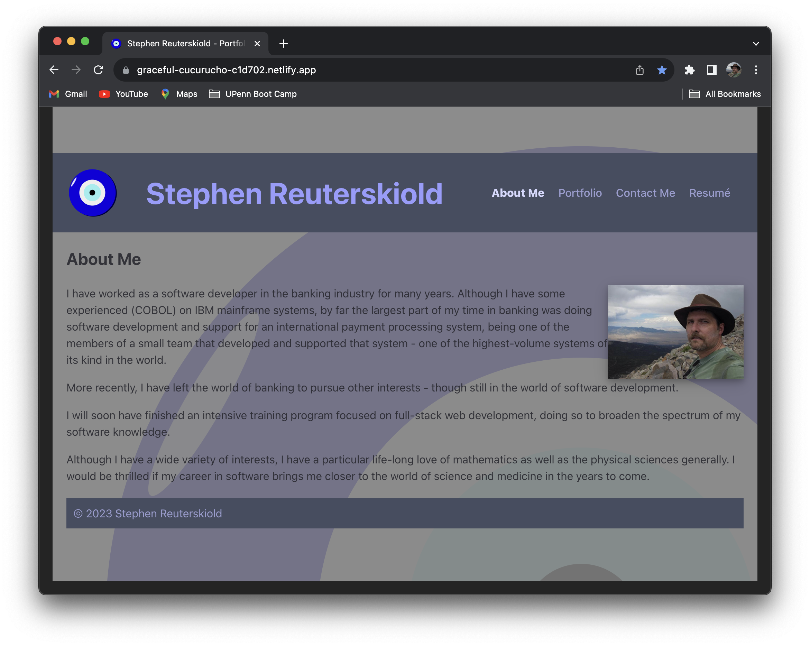
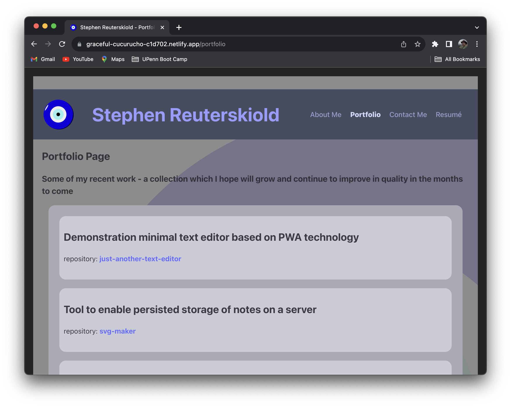
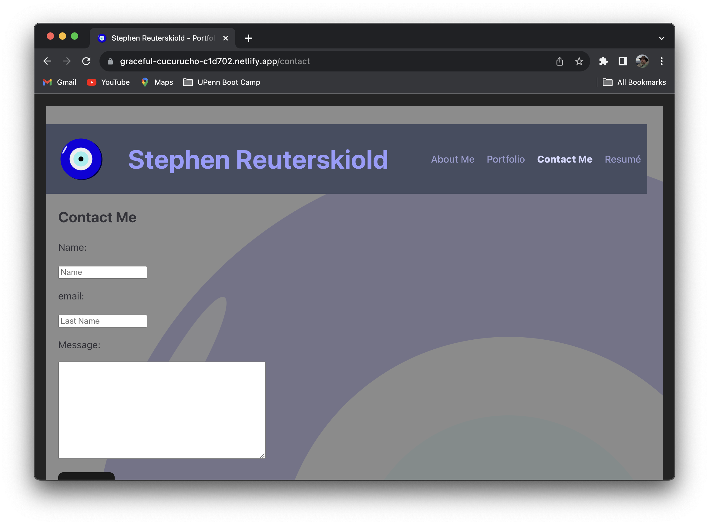
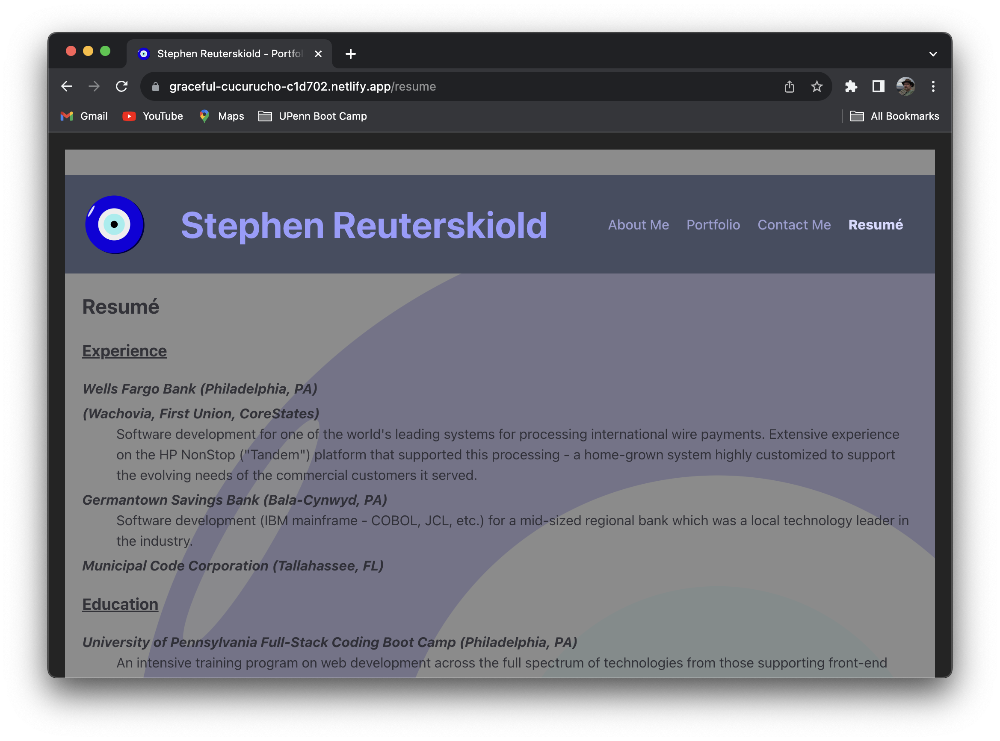

# My Portfolio

A portfolio page with some information about me, my resumé, and links to some of my GitHub repositories.
This portfolio is a React-based implementation, though front-end only.

## Description

This portfolio is implemented using React and, specifically react-dom-router which has eased the task of providing stylistic consistency across multiple pages.

Sample of the four screens accessible via the portfolio URL follow:

## Table of Contents

- [Installation](#installation)
- [Usage](#usage)
- [Credits](#credits)
- [License](#license)

## Installation

*(Note: These are installation instructions from a developer's point of view.  Inasmuch as this is a deployed web application, there is no installation for end users beyond accessing the [Netlify site URL for this app](https://graceful-cucurucho-c1d702.netlify.app).)*

### Developer installation instructions:

1. Install Node.js® if it is not already installed.    ([Node downloads](https://nodejs.org/en/download))
2. from the [my-portfolio repository of GitHub](https://github.com/stevreut/my-portfolio):
    - select the green "**<> Code**" button
    - select the "**Download ZIP**" button from the resulting pop-up dialog
3. Placed the resulting `my-portfolio-main.zip` file in the location of your choice.
4. Unpack the `my-portfolio-main.zip` file, which should resulting in a folder/directory with name `my-portfolio-main`:
    - on Mac: double-click
    - on Windows: right-click and [follow these instructions](https://support.microsoft.com/en-us/windows/zip-and-unzip-files-f6dde0a7-0fec-8294-e1d3-703ed85e7ebc)
5. Using bash, Mac terminal, or equivalent utility:
    - `cd` to the resulting `my-portfolio-main` directory
    - `npm install`
6. Again using bash, Mac terminal, or equivalent:
    - `npm run install`
7. To start the server locally:
    - `npm run dev`  *or*  `npm run start` 

## Usage

### End user

  - Access the [Netlify-deployed site](https://graceful-cucurucho-c1d702.netlify.app)

### Developer/tester

  - Access the local server at [localhost:3000](http://localhost:3000)  (noting, however, that the port *might* not be 3000 and the local server console logging should be checked to verify whether 3000 or some other port is in use)

## Credits

Special thanks to the teaching staff of the University of Pennsylvania Full Stack Coding Boot Camp (UPENN-VIRT-FSF-FT-07-2023-U-LOLC-M-F).

The class training materials and associated repository, especially activities in unit 20 were consulted extensively.

In addition, extensive use was made of the admirably thorough and lucid [React documentation](https://react.dev/learn).

## License

See MIT license in this GitHub repository.
